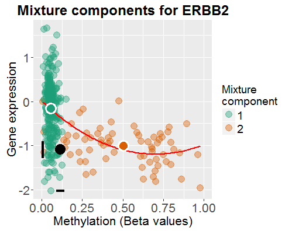
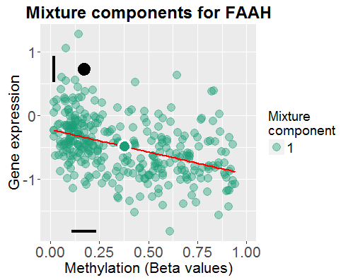
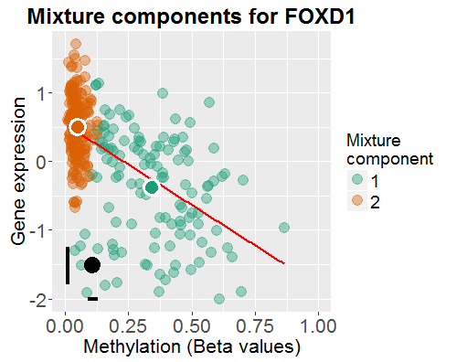
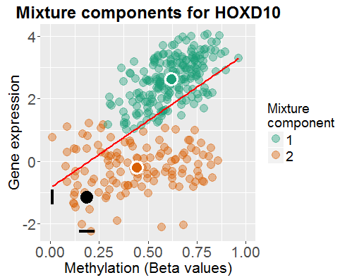
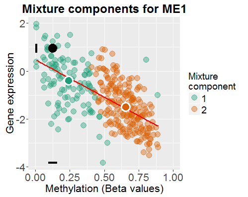
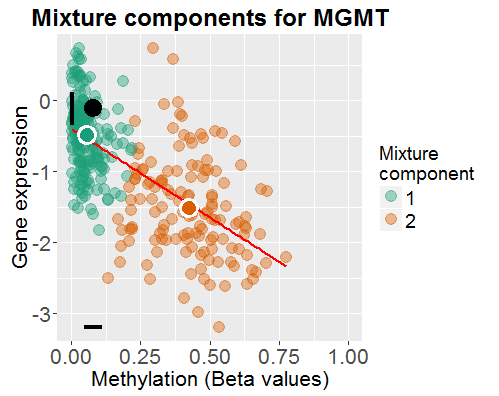

##1. Getting started

__Installing the package.__ _BIMEGA_ is available as an R package at GitHub.
It can be installed in the following way:

```{r, eval=FALSE}
library(devtools)
install_github("mpru/BIMEGA")
```

If you have problems with missing dependencies, the following lines will make
sure that all dependencies are installed.

```{r, eval=FALSE}
pkgs <- c("optparse", "doParallel", "plyr", "R.utils", "foreach", "RColorBrewer", "ggplot2", "RCurl", "data.table", "R.matlab", "digest", "robustbase", "mclust", "dplyr", "ellipse")
for (pkg in pkgs) install.packages(pkg) # From CRAN
source("https://bioconductor.org/biocLite.R")
pkgs <- c("impute", "limma")
for (pkg in pkgs) biocLite(pkg) # From Bioconductor
```

__Loading the package.__ To load the `BIMEGA` package in your R session, type `library(BIMEGA)`.

__Help files.__  Detailed information on `BIMEGA` package 
functions can be obtained in the help files. For example, to view the help file 
for the function `BIMEGA` in a R session, use `?BIMEGA`.

##2. Introduction

DNA methylation is a mechanism whereby a methyl-group is added onto a CpG site. 
Methylation of these CpG sites is associated with gene silencing and is an 
important mechanism for normal tissue development and is often involved in 
diseases such as cancer. Recently, many high throughput data has been generated 
profiling CpG site methylation on a genome wide bases. This has created large 
amounts of data on DNA methylation for many disease. Computational analysis of 
DNA methylation data is required to identify potentiall aberrant DNA methylation 
compared to normal tissue. BIMEGA was developed to tackle this question using 
a computational approach. BIMEGA identifies differential and functional DNA 
methylation by using a beta mixture model to identify subpopulations of samples 
with different DNA methylation compared to normal tissue. Functional DNA 
methylation refers to a significant negative correlation based on matched gene 
expression data. Together BIMEGA outputs hyper and hypomethylated genes which 
can be used for downstream analysis, and are called BIMEGA drivers. BIMEGA 
was designed for cis-regulated promoter differential methylation and works best 
when specific CpG sites are profiled associated with a gene. For example using 
data from the 27k and 450k Infinium platforms.

BIMEGA is based on MethylMix (Gevaert, 2015), extending its capabilities with a 
biviariate Gaussian mixture model fitted jointly to DNA methylation and gene expression data
to identify the subpopulations, and with a robust polynomial regression to study
the association between these two variables.

## 3. Data access and preprocessing

The `BIMEGA` package provides functions to access and preprocess data at The Cancer Genome Atlas (TCGA) 
portal. Given a cancer type indicated by TCGA's code and a path to save downloaded files, all the download and
preprocess of data can be executed with:

```{r, eval=FALSE}
cancerSite <- "OV"
targetDirectory <- paste0(getwd(), "/")
GetData(cancerSite, targetDirectory)
```

All functions in the `BIMEGA` package can be run in parallel, if the user provides a parallel set up, like
the following:

```{r, eval=FALSE}
cancerSite <- "OV"
targetDirectory <- paste0(getwd(), "/")

library(doParallel)
cl <- makeCluster(5)
registerDoParallel(cl)
GetData(cancerSite, targetDirectory)
stopCluster(cl)
```

The `GetData` function downloads DNA methylation data and gene expression. The methylation data
is provided using 27k or 450k Illumina platforms. If both 27k and 450k files are found, the data
is carefully combined. For gene expression, either microarray (Agilent), RNA sequencing data or
both are available. The `BIMEGA` package downloads RNA sequencing data for all cancer sites
except for ovarian and gliobastoma cancer sites (few RNA-seq samples available). 
For the preprocessing of the data, we package perform missing value estimation and batch
correction (using Combat).
Finally, as in the TCGA case, when only probe level Illumina data is available, mapping probes to genes is 
recommended before building mixture models. This allows to focus on cis-
regulated differential methylation by only focusing on differential methylation 
of CpG sites to their closest gene transcripts. Both the 27k and 450k Illumina 
platforms have database R packages that provide the necessary mapping 
information. We use the annotation to map probes to genes, before clustering the probes
within each gene. This whole process can take a long time, depending of the size of the data.

It is also possible to perform each one of these task individually using other functions 
in the `BIMEGA` package, as in the following example:

```{r, eval=FALSE, tidy=TRUE}
cancerSite <- "OV"
targetDirectory <- paste0(getwd(), "/")

cl <- makeCluster(5)
registerDoParallel(cl)

# Downloading methylation data
METdirectories <- Download_DNAmethylation(cancerSite, targetDirectory)
# Processing methylation data
METProcessedData <- Preprocess_DNAmethylation(cancerSite, METdirectories)
# Saving methylation processed data
saveRDS(METProcessedData, file = paste0(targetDirectory, "MET_", cancerSite, "_Processed.rds"))

# Downloading gene expression data
GEdirectories <- Download_GeneExpression(cancerSite, targetDirectory)
# Processing gene expression data
GEProcessedData <- Preprocess_GeneExpression(cancerSite, GEdirectories)
# Saving gene expression processed data
saveRDS(GEProcessedData, file = paste0(targetDirectory, "GE_", cancerSite, "_Processed.rds"))

# Clustering probes to genes methylation data
METProcessedData <- readRDS(paste0(targetDirectory, "MET_", cancerSite, "_Processed.rds"))
res <- ClusterProbes(METProcessedData[[1]], METProcessedData[[2]])

# Putting everything together in one file
toSave <- list(METcancer = res[[1]], METnormal = res[[2]], MAcancer = GEProcessedData[[1]], GEnormal = GEProcessedData[[2]], ProbeMapping = res$ProbeMapping)
saveRDS(toSave, file = paste0(targetDirectory, "data_", cancerSite, ".rds"))

stopCluster(cl)
```

## 4. Data input for BIMEGA

To run BIMEGA four data sets of a particular disease are used. The DNA methylation data and gene expression data for the disease samples, 
`METcancer` and `MAcancer`, respectively, allow to identify subgroup of samples with common methylation and expression profiles
through the fitting of the bivariate Gaussian mixture model for each gene of interest. These two data sets are also used to identify functional differnential methylation by fitting a polynomial robust regression model. 
`METnormal` is an appropriate normal or baseline methylation data which
is used to distinguish between hyper or increased methylation vs. hypo or decreased methylation.
Optionally, if `MAnormal`, the data set of gene expression for normal samples, is provided, it will be used in the plot function.
Each of these data sets are matrix objects with genes in the 
rows with unique rownames (e.g. gene symbols) and samples or patients in the 
columns with unique patient names. The `GetData` function described before
saves an R object which contains these matrices in the correct format.

As example, small data sets from TCGA of gliobastoma samples are availabe in the
`BIMEGA` package:

```{r, tidy=TRUE}
library(BIMEGA)
data(METcancer)
data(METnormal)
data(MAcancer)
data(MAnormal)
head(METcancer[, 1:4])
head(METnormal[, 1:4])
head(MAcancer[, 1:4])
head(MAnormal[, 1:4])
```

## 5. Running BIMEGA

Using the example gliobastoma data provided in the package, `BIMEGA` can be 
to identify hypo and hypermethylated genes run as follows:

```{r, tidy=TRUE, warning=F}
BIMEGAResults <- BIMEGA(METcancer, METnormal, MAcancer, MAnormal)
```

Or in parallel:

```{r, tidy=TRUE, eval=FALSE}
library(doParallel)
cl <- makeCluster(5)
registerDoParallel(cl)
BIMEGAResults <- BIMEGA(METcancer, METnormal, MAcancer, MAnormal)
stopCluster(cl)
```

The output from the `BIMEGA` function is a list with the following elements:

* `MethylationDrivers`: Genes identified as transcriptionally predictive and differentially methylated by BIMEGA.
* `NrComponents`: The number of methylation states found for each driver gene.
* `MixtureStates`: A list with the DM-values for each driver gene.
* `MethylationStates`: Matrix with DM-values for all driver genes (rows) and all samples (columns).
* `Classifications`: Matrix with integers indicating to which mixture component each cancer sample was assigned to, for each gene.
* `Models`: Beta mixture model parameters for each driver gene.
* `FunctionalGenesResults`: Matrix with information on the polynomial regression fit for each driver gene.

Differential Methylation values (DM-values) are defined as the difference between 
the methylation mean in one mixture component of cancer samples and the methylation mean
in the normal samples, for a given gene.

```{r, tidy=TRUE}
BIMEGAResults$MethylationDrivers
BIMEGAResults$NrComponents
BIMEGAResults$MixtureStates
BIMEGAResults$MethylationStates[, 1:5]
BIMEGAResults$Classifications[, 1:5]
head(BIMEGAResults$FunctionalGenesResults)
# BIMEGAResults$Models
```

## 6. Graphical output

The `BIMEGA` package also provides a function to visually represent the findings.
The `BIMEGA_PlotModel` produces a scatterplot between DNA methylation and gene expression,
where colors represent different mixture states. Dots with white borders represent centroids 
for DNA methylation and gene expression in each subgroup. For normal samples, the black
dot represents the centroid, the black ellipse represents the bivariate 95% confidence 
ellipse for normal data, and the vertical and horizontal black lines
represent 95% univariate confidence intervals for gene expression and methylation. 
These symbols might be missing if the required data is not available for
normal data (for example, no ellipse is shown if methylation and gene expression for
normal samples is not matched by patients).

```{r, tidy=TRUE, eval=F}
for (gene in BIMEGAresults$MethylationDrivers) {
    g <- BIMEGA_Plot(gene, BIMEGAresults, METcancer, MAcancer, METnormal, MAnormal)
    plot(g)
}
```

  

  


## 7. Sesssion Info

```{r, tidy=TRUE, echo = FALSE}
sessionInfo()
```


## References

Gevaert,O. (2015) MethylMix: an R package for identifying DNA methylation-driven genes. Bioinformatics), 31, 1839-41.